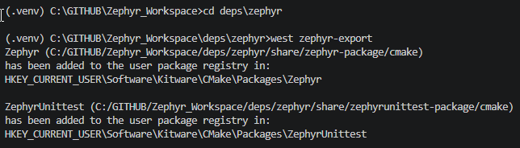
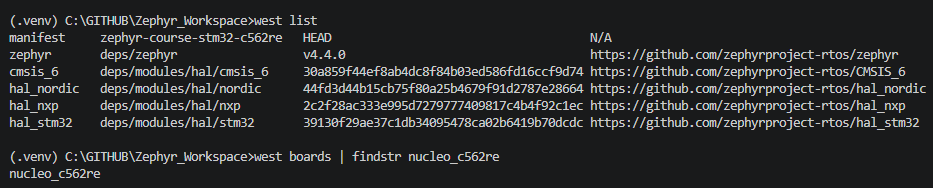
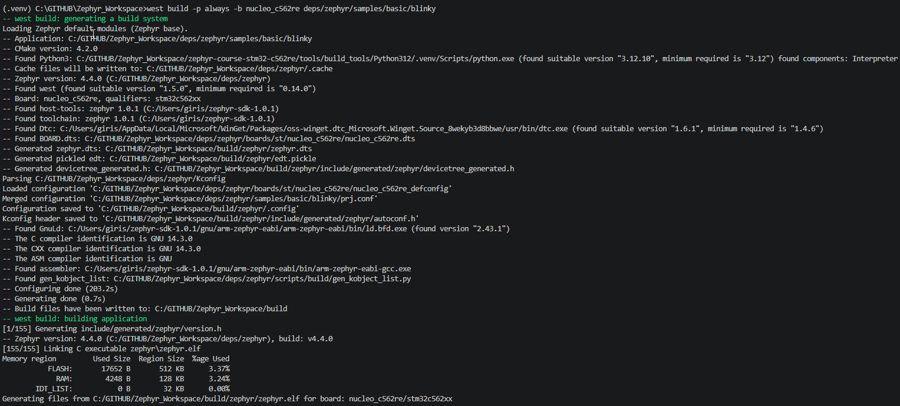
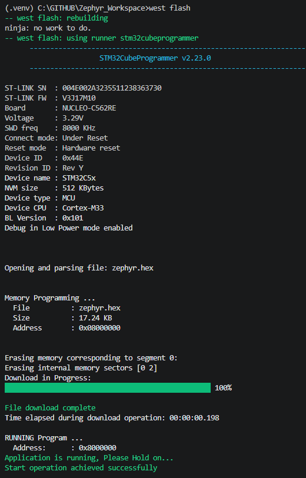
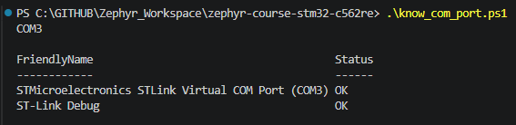
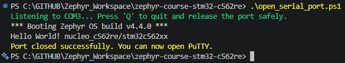
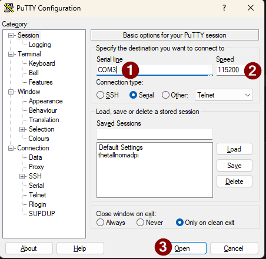
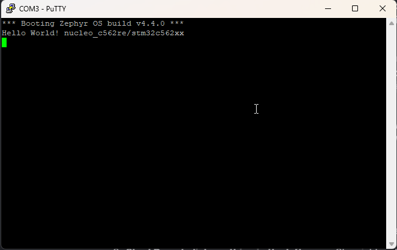

# Zephyr Course — STM32 Nucleo C562RE

[](https://docs.zephyrproject.org/4.4.0/)
[](https://www.st.com/en/evaluation-tools/nucleo-c562re.html)
[](https://developer.arm.com/Processors/Cortex-M33)
[](https://www.microsoft.com/windows)
[](LICENSE)

Zephyr RTOS course exercises and sample projects for the **STM32 Nucleo C562RE** development
board, developed on **Windows**. This repository is a fork of the
[iomico-public/zephyr-course](https://github.com/iomico-public/zephyr-course) and is structured
as a west manifest repository — it declares which version of Zephyr to fetch and where to place it,
but does not contain the Zephyr kernel source itself.

---

## Table of Contents

- [Hardware](#hardware)
- [Repository Structure](#repository-structure)
- [Workspace Layout](#workspace-layout)
- [Prerequisites](#prerequisites)
  - [1. Install Host Tools](#1-install-host-tools)
  - [2. Set Up Portable Python 3.12](#2-set-up-portable-python-312)
- [Getting Started](#getting-started)
  - [3. Clone the Repository](#3-clone-the-repository)
  - [4. Initialize Submodules](#4-initialize-submodules)
  - [5. Initialize the West Workspace](#5-initialize-the-west-workspace)
  - [6. Update the West Workspace](#6-update-the-west-workspace)
  - [7. Create the Python Virtual Environment](#7-create-the-python-virtual-environment)
  - [8. Activate the Virtual Environment](#8-activate-the-virtual-environment)
  - [9. Install west](#9-install-west)
  - [10. Install Zephyr Python Dependencies](#10-install-zephyr-python-dependencies)
  - [11. Register Zephyr with CMake](#11-register-zephyr-with-cmake)
  - [12. Install the Zephyr SDK](#12-install-the-zephyr-sdk)
  - [13. Add Build Tools to PATH](#13-add-build-tools-to-path)
- [Building an Application](#building-an-application)
  - [Build the Blinky Sample (nucleo\_c562re)](#build-the-blinky-sample-nucleo_c562re)
- [Flashing to the Board](#flashing-to-the-board)
- [Daily Workflow](#daily-workflow)
- [Troubleshooting](#troubleshooting)
- [References](#references)

---

## Hardware

| Item | Detail |
|------|--------|
| Board | NUCLEO-C562RE |
| MCU | STM32C562RE |
| Core | ARM Cortex-M33 |
| Flash | 512 KB |
| RAM | 128 KB |
| Debugger | STLINK-V3EC (onboard) |
| User LED | LD1 — PA5 (green) |
| User Button | B1 — PC13 |
| USB connector | USB Type-C (ST-LINK side) |

> **Note:** The Nucleo C562RE was introduced as a supported board in **Zephyr 4.4.0**. Earlier
> versions of Zephyr do not have board support for this hardware.

---

## Repository Structure

```
zephyr-course-stm32-c562re/
│
├── app/                        # Your application source code (exercises go here)
├── tests/                      # Test applications
├── imgs/                       # Screenshots and reference images for this README
├── west.yml                    # West manifest — declares Zephyr 4.4.0 and all modules
├── activate_venv.bat           # Session activation script (run at start of every session)
├── deactivate_venv.bat         # Session deactivation script (run at end of every session)
├── .gitmodules                 # Tracks the build_tools submodule
├── .gitignore
├── LICENSE
├── README.md                   # This file
│
└── tools/
    └── build_tools/            # Submodule: <windows_user>hTabaraddi/build_tools
        ├── CMake/              # Portable CMake binaries (Windows)
        ├── ninja-win/          # Portable Ninja build tool (Windows)
        ├── Python312/          # Portable Python 3.12 interpreter (Windows, see step 2)
        ├── Python/             # Python helper scripts (can be used when 3.13 and above python is needed)
        ├── MinGW/              # MinGW GCC toolchain (Windows)
        └── zephyr/             # Zephyr-specific scripts and configuration
            ├── scripts/        # PowerShell setup and build helpers
            ├── requirements/   # Pinned Python dependency files
            └── sdk-config/
                └── sdk-version.txt   # Pinned Zephyr SDK version (0.17.4)
```

---

## Workspace Layout

This repository is a **west manifest repository**. It is one folder inside a larger west workspace.
West downloads Zephyr and all module dependencies into sibling folders outside this repo.
The full workspace on disk looks like this:

```
Zephyr_Workspace/
│
├── .west/                      # West metadata (auto-generated, not in git)
│
├── deps/
│   ├── zephyr/                 # Zephyr 4.4.0 RTOS source (west-managed, not in git)
│   └── modules/                # HALs, crypto, filesystem drivers (west-managed, not in git)
│       └── hal/
│           └── stm32/          # STM32 HAL — required for the Nucleo C562RE
│
└── zephyr-course-stm32-c562re/ # THIS REPOSITORY (The manifest repo)
    ├── app/
    ├── west.yml
    └── tools/build_tools/
```

> **Important:** The `deps/` folder is never committed to git. It is entirely reproduced by
> running `west update` against the pinned versions declared in `west.yml`. This is how
> reproducibility is guaranteed without storing gigabytes of source code in your repo.

---

## Prerequisites

### 1. Install Host Tools

Open **PowerShell** (no admin required for most steps) and install the required tools.

#### 1.1 — Git

```powershell
winget install --id Git.Git -e --source winget
git --version   # Verify
```

#### 1.2 — CMake (>= 3.28.0 required by Zephyr)

> If `tools\build_tools\CMake\` already contains a version >= 3.28.0 you can use that instead
> and skip this step. See [Step 13](#13-add-build-tools-to-path) for how to prefer it.

```powershell
winget install Kitware.CMake -e --source winget
cmake --version   # Must print 3.28.0 or newer
```

#### 1.3 — Ninja

> `tools\build_tools\ninja-win\` can be used directly. See [Step 13](#13-add-build-tools-to-path).

```powershell
winget install Ninja-build.Ninja -e --source winget
ninja --version   # Verify
```

#### 1.4 — Python 3.12

> **Zephyr 4.4.0 requires Python 3.12 specifically.** Python 3.13 and newer may fail when
> installing Zephyr's Python packages on Windows. Do not use a system-wide Python for Zephyr —
> use the portable Python 3.12 from `build_tools` instead (see [Step 2](#2-set-up-portable-python-312)).

If you want a system Python 3.12 as a fallback:

```powershell
winget install Python.Python.3.12 -e --source winget
py -3.12 --version   # Should print Python 3.12.x
```

#### 1.5 — Other Required Tools

```powershell
winget install oss-winget.gperf -e --source winget   # Perfect hash generator
winget install oss-winget.dtc -e --source winget     # Devicetree compiler (>= 1.4.6)
winget install wget -e --source winget
winget install 7zip.7zip -e --source winget
```

#### 1.6 — STM32CubeProgrammer (required for flashing)

The Nucleo C562RE uses STM32CubeProgrammer as its default flash runner.
The `st-link` tool that ships with most Linux package managers does not recognise this chip.

1. Go to: https://www.st.com/en/development-tools/stm32cubeprog.html
2. Download the latest Windows installer (free ST account required)
3. Run the installer and accept the default install path
4. Verify:

```powershell
STM32_Programmer_CLI --version
```

If the command is not found, add the install path to your user PATH:

```powershell
# Default install location:
$ProgDir = "C:\Program Files\STMicroelectronics\STM32Cube\STM32CubeProgrammer\bin"
[Environment]::SetEnvironmentVariable("Path", [Environment]::GetEnvironmentVariable("Path","User") + ";" + $ProgDir, "User")
```

Restart PowerShell and verify again.

#### 1.7 — ST-LINK USB Driver

The driver is usually installed automatically by STM32CubeProgrammer or STM32CubeIDE.
To verify your board is recognised:

```powershell
Get-PnpDevice | Where-Object { $_.InstanceId -like "*VID_0483*" -and $_.InstanceId -like "*PID_3754*" }
```

Expected output: a device entry with `Status: OK`. If the status shows an error, download the
driver from https://www.st.com/en/development-tools/stsw-link009.html.

---

### 2. Set Up Portable Python 3.12

The `build_tools` submodule ships with (or can provision) a portable Python 3.12 interpreter
under `tools\build_tools\Python312\`. This is completely self-contained — it does not touch
your system Python or PATH.

Before running the below `setup_python312.ps1` script, run the below command and ignore running the ps1 script if the below step works.
```powershell
.\tools\build_tools\Python312\python.exe --version
# Expected: Python 3.12.x
```

Run the setup script once after cloning:

```powershell
cd C:\GITHUB\Zephyr_Workspace\zephyr-course-stm32-c562re

powershell -ExecutionPolicy Bypass -File tools\build_tools\zephyr\scripts\setup_python312.ps1
```

The script:
1. Checks whether `Python312\python.exe` already exists and at which version
2. Downloads the Python 3.12 Windows embeddable package (~12 MB) from python.org if needed
3. Extracts it to `tools\build_tools\Python312\`
4. Enables `site-packages` (required for pip to work with embedded Python)
5. Installs pip and virtualenv into the embedded interpreter

Verify the portable interpreter works:

```powershell
.\tools\build_tools\Python312\python.exe --version
# Expected: Python 3.12.x
```

---

## Getting Started

### 3. Clone the Repository

The workspace parent folder (`Zephyr_Workspace`) must exist before cloning. Create it first,
then clone this repo inside it:

```powershell
mkdir C:\GITHUB\Zephyr_Workspace
cd C:\GITHUB\Zephyr_Workspace

git clone git@github.com:<windows_user>hTabaraddi/zephyr-course-stm32-c562re.git
cd zephyr-course-stm32-c562re
```

---

### 4. Initialize Submodules

The `build_tools` repo is linked as a git submodule. After cloning, the
`tools\build_tools\` folder exists but is empty until you run:

```powershell
git submodule update --init --recursive
```

Verify:

```powershell
dir tools\build_tools\CMake     # Should list files, not be empty
dir tools\build_tools\ninja-win
```

---

### 5. Initialize the West Workspace

West is Zephyr's workspace manager. It needs to know that this repo is the **manifest repo** —
the one that contains `west.yml` declaring which Zephyr version to fetch.

Run this from the **parent of the repo** (i.e., from `Zephyr_Workspace\`), not from inside the repo:

```powershell
cd C:\GITHUB\Zephyr_Workspace

# -l means "local" — your repo is already cloned, do not clone again
west init -l zephyr-course-stm32-c562re
```

This creates `Zephyr_Workspace\.west\config` — a small file that records the manifest location.
No Zephyr source is downloaded yet.

Verify:

```powershell
dir .west    # Should contain a config file
type .west\config
```

Expected output of `config`:

```ini
[manifest]
path = zephyr-course-stm32-c562re
file = west.yml
```

---

### 6. Update the West Workspace

This is the download step. West reads `west.yml`, fetches Zephyr 4.4.0 and all its declared
module dependencies (STM32 HAL, crypto libraries, filesystem drivers, etc.) into the `deps\`
folder:

```powershell
# Must run from Zephyr_Workspace\ (where .west\ lives)
cd C:\GITHUB\Zephyr_Workspace

west update
```

This downloads approximately 1–3 GB depending on which modules are declared in the Zephyr 4.4.0
manifest. It only runs once — subsequent `west update` calls fetch only what has changed.

When complete, verify the key folders exist:

```powershell
dir deps\zephyr          # Zephyr 4.4.0 kernel source
dir deps\modules\hal\stm32   # STM32 HAL (required for the Nucleo board)
```

Also verify your board's definition was fetched:

```powershell
dir deps\zephyr\boards\st\nucleo_c562re
# Should list: nucleo_c562re.dts  nucleo_c562re_defconfig  Kconfig.board  etc.
```

---

### 7. Create the Python Virtual Environment

The virtual environment isolates all Zephyr Python packages from any other Python installation
on your machine. Create it inside the repo folder using the portable Python 3.12:

```powershell
cd C:\GITHUB\Zephyr_Workspace\zephyr-course-stm32-c562re

# Create the venv using the portable Python 3.12 from build_tools
.\tools\build_tools\Python312\python.exe -m virtualenv .venv
```

Expected output:

```
created virtual environment CPython3.12.10.final.0 in 3421ms
  creator CPython3Windows(...) destination=...\zephyr-course-stm32-c562re\.venv
```

The `.venv` folder is listed in `.gitignore` and must never be committed — it is machine-specific.

---

### 8. Activate the Virtual Environment

```powershell
.\.venv\Scripts\Activate.ps1
```

Your prompt prefix changes to `(.venv)` when the activation succeeds.

If PowerShell blocks this script:

```powershell
Set-ExecutionPolicy -Scope CurrentUser -ExecutionPolicy RemoteSigned
.\.venv\Scripts\Activate.ps1   # Try again
```

> **You must activate the venv at the start of every development session.**
> The `activate_venv.bat` script in the repo root automates this
> along with setting PATH entries for CMake, Ninja, and the SDK.
> See [Daily Workflow](#daily-workflow).

---

### 9. Install west

With the venv active, install west into it:

```powershell
pip install west
west --version   # Verify
```

Confirm west is running from your venv, not a global install:

```powershell
where.exe west
# Must print a path inside .venv\Scripts\, not C:\Users\...
```

---

### 10. Install Zephyr Python Dependencies

Zephyr declares its own set of required Python packages (devicetree tools, build helpers, image
signing tools, etc.) in requirements files inside `deps\zephyr\scripts\requirements\`.
The `west packages` command reads these and installs them into your active venv:

```powershell
# Run from Zephyr_Workspace\ (west must be able to find deps\zephyr\)
cd C:\GITHUB\Zephyr_Workspace

west packages pip --install
```

This installs packages including `pyelftools`, `PyYAML`, `packaging`, `colorama`, and others.
It may also update the `west` version itself to the one Zephyr 4.4.0 was tested against.

Verify the key packages:

```powershell
pip show pyelftools
pip show PyYAML
pip show west
```

---

### 11. Register Zephyr with CMake

This step writes a pointer into Windows' CMake package registry so that `find_package(Zephyr)`
in any CMakeLists.txt can locate your workspace. Without this, every build fails with
`Could not find package Zephyr`.

```powershell
# Navigate into the Zephyr source folder
cd C:\GITHUB\Zephyr_Workspace\deps\zephyr

west zephyr-export
```

Expected output:



```
Zephyr (C:/GITHUB/Zephyr_Workspace/deps/zephyr/share/zephyr-package/cmake)
has been added to the CMake user package registry in:
HKEY_CURRENT_USER\Software\Kitware\CMake\Packages\Zephyr
```

> Run this once per machine, or again if you ever move the workspace to a different path.

---

### 12. Install the Zephyr SDK

The Zephyr SDK contains the ARM cross-compiler (`arm-zephyr-eabi-gcc`) targeting Cortex-M33,
as well as OpenOCD for debugging. It is installed to a fixed location on your machine and is
**not** part of this repository.

Install only the ARM toolchain (approximately 400 MB, not the full 12 GB SDK):

```powershell
# Still inside deps\zephyr\
cd C:\GITHUB\Zephyr_Workspace\deps\zephyr

west sdk install --toolchains arm-zephyr-eabi
```

West reads the `SDK_VERSION` file inside `deps\zephyr\` to determine which SDK version Zephyr
4.4.0 requires. It downloads and installs that exact version to `C:\zephyr-sdk-X.X.X\`.

Verify the installation:

```powershell
# Replace X.X.X with the version that was installed
dir C:\zephyr-sdk-X.X.X\arm-zephyr-eabi\bin\arm-zephyr-eabi-gcc.exe

# Print the compiler version
C:\zephyr-sdk-X.X.X\arm-zephyr-eabi\bin\arm-zephyr-eabi-gcc.exe --version
```
> [!NOTE]
> Sometimes the installation fails with the following error:
> 
> ```text
> Zephyr SDK setup requires '7z' to be installed and available in the PATH.
> Please install '7z' and run this script again.
> FATAL ERROR: command "C:\Users\<windows_user>\zephyr-sdk-1.0.1\setup.cmd /c" failed
> ```
> 
> If this happens, copy `7z.dll` and `7z.exe` from your 7-Zip installation directory (usually `C:\Program Files\7-Zip`) and paste them directly into your extracted SDK folder at `C:\Users\<windows_user>\zephyr-sdk-1.0.1`. Then, run the setup script again.

Expected output:



```
arm-zephyr-eabi-gcc.exe (Zephyr SDK X.X.X) 13.x.x ...
```

---

### 13. Add Build Tools to PATH

Set the Zephyr SDK environment variable:

```windows batch

# Set Zephyr SDK path
echo set ZEPHYR_SDK_INSTALL_DIR=C:\Users\<windows_user>\zephyr-sdk-1.0.1 >> tools\build_tools\Python312\.venv\Scripts\activate.bat
echo set ZEPHYR_TOOLCHAIN_VARIANT=zephyr >> tools\build_tools\Python312\.venv\Scripts\activate.bat


# Verify
cmake --version    # Must be >= 3.28.0
ninja --version
echo $env:ZEPHYR_SDK_INSTALL_DIR
```

> These settings apply to the current PowerShell session only. The `activate_venv.bat`
> script in the repo root sets them automatically at the start of each session.
> See [Daily Workflow](#daily-workflow).

---

## Building an Application

### Build the Blinky Sample (nucleo\_c562re)

The blinky sample is included in the Zephyr source tree. It blinks the user LED (LD1, PA5) once
per second using the Zephyr GPIO API — a good first build to verify the entire toolchain works.

Ensure:
- The virtual environment is active (`(.venv)` prefix visible)
- `cmake --version` prints >= 3.28.0
- `ninja --version` prints a version
- `$env:ZEPHYR_SDK_INSTALL_DIR` is set

Then build:

```powershell
# Run from the workspace root
cd C:\GITHUB\Zephyr_Workspace

# -p always   = pristine (clean) build — always use on first build of a sample
# -b nucleo_c562re   = target board identifier (Zephyr's internal name)
# deps/zephyr/samples/basic/blinky   = path to the sample (relative to workspace root)

west build -p always -b nucleo_c562re deps/zephyr/samples/basic/blinky
```

A successful build ends with memory usage output similar to:

```
[xxx/xxx] Linking C executable zephyr/zephyr.elf
Memory region         Used Size   Region Size   %age Used
           FLASH:       12480 B       512 KB      2.38%
            SRAM:        4096 B       128 KB      3.12%
```



The compiled binary is placed at `Zephyr_Workspace\build\zephyr\zephyr.elf`
and `Zephyr_Workspace\build\zephyr\zephyr.bin`.

#### Common Build Errors

| Error | Cause | Fix |
|-------|-------|-----|
| `CMake Error: could not find Zephyr` | `west zephyr-export` not run | Re-run step 11 from `deps\zephyr\` |
| `cmake: minimum required version 3.28` | Old CMake in PATH | Run step 13 to add `build_tools\CMake\bin` to PATH |
| `arm-zephyr-eabi-gcc: command not found` | SDK not found | Set `$env:ZEPHYR_SDK_INSTALL_DIR` (step 13) |
| `No such file: deps/zephyr/samples/...` | Wrong working directory | Run `west build` from `Zephyr_Workspace\`, not from inside the repo |
| `ninja: command not found` | Ninja not on PATH | Run step 13 to add `build_tools\ninja-win` to PATH |

---

## Flashing to the Board

The Nucleo C562RE uses **STM32CubeProgrammer** as its default west flash runner.

1. Connect the Nucleo board to your PC via the **USB-C cable on the ST-LINK side** (the connector
   nearest to the ST-LINK chip, labelled CN1 on the board).

2. Verify the board is recognised:

```powershell
Get-PnpDevice | Where-Object { $_.InstanceId -like "*VID_0483*" -and $_.InstanceId -like "*PID_3754*" }
```

   Expected: a device with `Status: OK` and `FriendlyName` containing `STLink`.

3. Flash the build output:

```powershell
# Run from the same directory where west build was run (Zephyr_Workspace\)
west flash
```

STM32CubeProgrammer is called automatically. The output identifies your board, erases the
relevant flash sectors, downloads the binary, and starts execution:



After flashing completes, the green LED **LD1** (PA5) on your Nucleo board starts blinking
once per second.

#### Using an Alternative Flash Runner

If you have a JLink probe (version >= v8.12e):

```powershell
west flash --runner jlink
```

---

## Daily Workflow

After the one-time setup above, your session workflow for every subsequent day is:

```powershell
# 1. Open PowerShell

# 2. Go to the repo and activate the full environment
#    (dot-source to keep the venv active in the current shell)
cd C:\GITHUB\Zephyr_Workspace\zephyr-course-stm32-c562re
. .\activate_venv.bat

# 3. Go to workspace root to run west commands
cd C:\GITHUB\Zephyr_Workspace

# 4. Build your application
#    Replace the sample path with your own app path when working on exercises:
#    e.g.  zephyr-course-stm32-c562re/app
west build -p always -b nucleo_c562re deps/zephyr/samples/basic/blinky

# 5. Flash
west flash

# 6. Open serial monitor to read UART output from the board
#    Find the COM port assigned to the ST-LINK VCP:
open powershell terminal on the side
.\know_com_port.ps1
```


```
#    Open in PowerShell (replace COM3 with your actual port):
In the same powershell window, run the below script to open the port:
.\open_serial_port.ps1
```



```
#    Press Q to stop

If you are using Putty tool, then do the following setting:
```



```
Output will be displayed as below:
```



```

The `activate_venv.bat` script handles steps 2's details automatically:
it activates the venv, adds CMake and Ninja from `build_tools` to PATH, and sets
`ZEPHYR_SDK_INSTALL_DIR`.

---

## Troubleshooting

### west command not found after activating venv

The venv activation must be done in the same shell session where you run west. If you open a
new PowerShell window, activate again:

```powershell
cd C:\GITHUB\Zephyr_Workspace\zephyr-course-stm32-c562re
. .\activate_venv.bat
```

### west update fails with SSL or proxy errors

If you are behind a corporate proxy:

```powershell
$env:HTTPS_PROXY = "http://proxy.company.com:8080"
$env:HTTP_PROXY  = "http://proxy.company.com:8080"
west update
```

### Board not found when flashing

```
Error: expected exactly 1 runner to match "stm32cubeprogrammer", but found 0
```

STM32CubeProgrammer is not on PATH. Either add it manually:

```powershell
$env:Path += ";C:\Program Files\STMicroelectronics\STM32Cube\STM32CubeProgrammer\bin"
```

Or run the full setup script again to persist the PATH entry.

### flash: 0 shown by st-info or stlink-tools

This is expected. The `stlink-tools` package in standard package managers has an outdated chip
database that does not know about the STM32C562RE (new silicon released 2025/2026). Always use
STM32CubeProgrammer for this board, either through `west flash` or directly via
`STM32_Programmer_CLI`.

### west packages pip --install fails with Python errors

Ensure you are using the portable Python 3.12 venv, not a system Python 3.13 or newer:

```powershell
python --version   # Must print 3.12.x inside the active venv
```

If it prints 3.13 or higher, deactivate and recreate the venv using the portable interpreter:

```powershell
deactivate
Remove-Item -Recurse -Force .venv
.\tools\build_tools\Python312\python.exe -m virtualenv .venv
. .\.venv\Scripts\Activate.ps1
pip install west
```

Then repeat steps 10 onwards.

### cmake --version prints a version older than 3.28.0

The system CMake is being picked up instead of the one from build_tools.
Add build_tools to PATH before the system PATH:

```powershell
$env:Path = "C:\GITHUB\Zephyr_Workspace\zephyr-course-stm32-c562re\tools\build_tools\CMake\bin;" + $env:Path
cmake --version   # Should now print the newer version
```

---

## References

| Resource | Link |
|----------|------|
| Zephyr Getting Started Guide | https://docs.zephyrproject.org/latest/develop/getting_started/index.html |
| Zephyr 4.4.0 Release Notes | https://docs.zephyrproject.org/latest/releases/release-notes-4.4.html |
| Nucleo C562RE Board Page (Zephyr docs) | https://docs.zephyrproject.org/latest/boards/st/nucleo_c562re/doc/index.html |
| STM32C562RE Product Page | https://www.st.com/en/microcontrollers-microprocessors/stm32c562re.html |
| STM32C5 Reference Manual | https://www.st.com/resource/en/reference_manual/rm0522-stm32c5.pdf |
| Nucleo C562RE User Manual | https://www.st.com/resource/en/user_manual/um3615-stm32c5.pdf |
| STM32CubeProgrammer | https://www.st.com/en/development-tools/stm32cubeprog.html |
| Zephyr SDK Releases | https://github.com/zephyrproject-rtos/sdk-ng/releases |
| build_tools Repository | https://github.com/girishTabaraddi/build_tools |
| iomico Zephyr Course (upstream) | https://github.com/iomico-public/zephyr-course |

---

> **Board support note:** The STM32C5 series, including the STM32C562RE, received official Zephyr
> support through a collaboration between ST and the Zephyr community, introduced in Zephyr 4.4.0
> (released April 2026). Earlier Zephyr versions do not include this board's device tree or
> Kconfig definitions.
